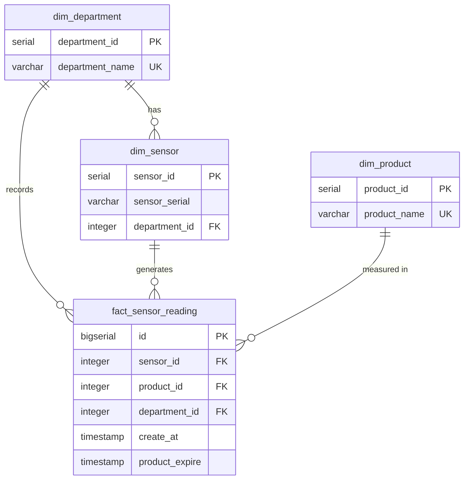

# Database Schema — Sensor Data Pipeline

## ER Diagram

## Table Details

### dim_department
| Column | Type | Constraints |
|--------|------|-------------|
| department_id | SERIAL | PRIMARY KEY |
| department_name | VARCHAR(32) | NOT NULL, UNIQUE |

### dim_sensor
| Column | Type | Constraints |
|--------|------|-------------|
| sensor_id | SERIAL | PRIMARY KEY |
| sensor_serial | VARCHAR(64) | NOT NULL |
| department_id | INTEGER | NOT NULL, FK → dim_department |
| | | UNIQUE (sensor_serial, department_id) |

### dim_product
| Column | Type | Constraints |
|--------|------|-------------|
| product_id | SERIAL | PRIMARY KEY |
| product_name | VARCHAR(16) | NOT NULL, UNIQUE |

### fact_sensor_reading
| Column | Type | Constraints |
|--------|------|-------------|
| id | BIGSERIAL | PRIMARY KEY |
| sensor_id | INTEGER | NOT NULL, FK → dim_sensor |
| product_id | INTEGER | NOT NULL, FK → dim_product |
| department_id | INTEGER | NOT NULL, FK → dim_department |
| create_at | TIMESTAMP | NOT NULL |
| product_expire | TIMESTAMP | NOT NULL |

**Indexes:** idx_fact_sensor, idx_fact_dept, idx_fact_product, idx_fact_create_at
